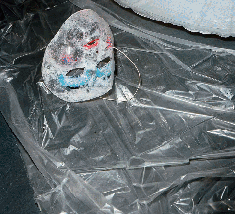

Hush-Hush in Residence

March 5th – April 5th

*HIT gallery is please to have HUSH-HUSH in residence from March 5th - April 5th. HUSH-HUSH is collective of queer and trans artists in the Bay Area and beyond who make experimental work between genres. They welcome the bent,  the sticky, the hushed. At HUSH-HUSH events, traditionally held on fourth Thursdays at The Stud, the gay bar becomes a softer world, a communal hallucination. The reseidency will include daytime workshops on bad acting, noise shows, unconventional drag, poetry readings, one-on-one dance shows. Curated by choreographer Silk Worm and novelist Brittany Newell, HUSH-HUSH in residence promises to give a new crop of queer and trans artists the space to slow down, fall in, freak out. Shhh… the walls are listening.*

<figure>
  
</figure>

### UPCOMING

3/29 Secret Show – email hitgallerysf  [at] gmail for details!

3/31 Sappho & Sweat workshop with Chani Bockwinkel

4/1 Secret Show – email hitgallerysf [at] gmail for details

4/5 Show with performers TBA

### PAST
3/19 Bookworms with Monique Jenkinson, Brittany Newell, and Jewish Community Center

3/11 Secret Show

3/8 BAD VIBRATION with PRICE, Thomas Dupal, Waxy Tomb, and Julius Smack
