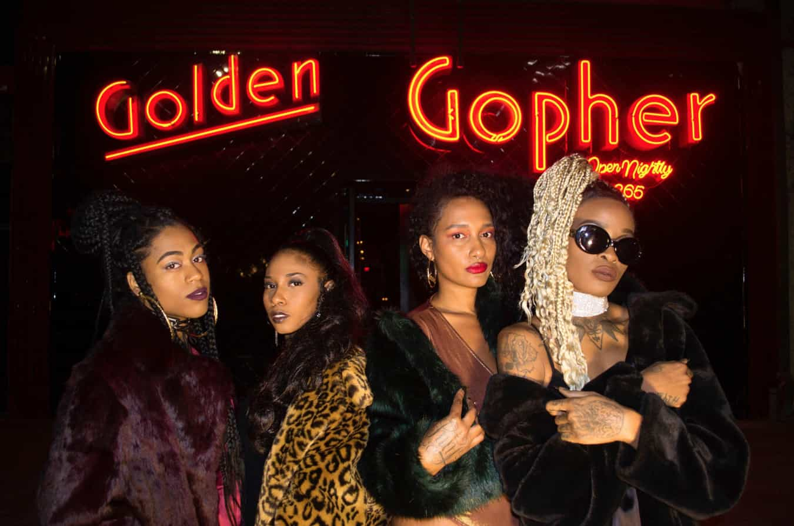

Neon Paradise

Cleo Torres

Opening reception May 19th.

<figure>
  
</figure>

Cleonette Harris is excited to introduce you to her colorful and vibrant Solo Exhibition that is Neon Paradise Los Angeles. Located at one of Los Angeles DIY Artist run spaces, Last Projects, that introduces various up and coming Queer Artists. Cleo will be presenting to you a feel of the past by giving old florescence Neon Signs another life in a photographic setting. Cleo is a Photographer first but also a Club Promoter of Los Angeles Queer, Femme and Trans party, Club Clit , which has brought her in contact with various underground Artists and Performers that have become subjects in her work. With different muses for each sign ranging from Drag Performers , Musicians, Fashion Designers, DJs , Photographers , Cleo is shining a light on these Artists just as bright as the Neons shine at the midnight hour.
